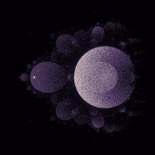

# Fractal Renderer (buddha mode)

This is a very simple program used to render fractals to images using a parameter json file.

It includes different fractal kinds among which the Mandelbrot set and a (potentially new) kind of fractal I came up with by using second- and third-degree recursive sequences instead of the classic first-degree recursive pattern used to draw the Mandelbrot set..

# How to use

First, download the latest executable from the [releases tab](https://github.com/valflrt/fractal_renderer/releases/latest).

Next, create a json file that with the following structure (see [parameter file reference](#parameter-file-reference)):

```jsonc
{
  "img_width": ...,
  "img_height": ...,
  "zoom": 1.0,
  "center_x": 0.0,
  "center_y": 0.0,
  "max_iter": 80000,
  "fractal": ...,
}
```

Then, in order to render your fractal, run the following command:

```
./fractal_renderer path/to/param_file.json path/to/output_image.png
```

> [!NOTE]
> Supported image formats are png and jpg (extension used to guess image format)

Alternatively, if you have rust installed and downloaded this repository:

```
cargo run -r -- fractal.json fractal.png
```

# Preset renders

These are preset renders I find pretty, you can get their json parameters files by clicking on the title. There are some more in [`presets/`](./presets/).

### [fractal.json](./presets/fractal.json)



# Parameter file reference

- `img_width` and `img_height`: Set image width and height (integers, in pixel).

- `zoom`: Set zoom (float).

- `center_x` and `center_y`: Set the position of the center of the render area (floats).

  > [!NOTE]
  > This corresponds to coordinates of the center of the render area in the complex plane: `z = center_x + i * center_y`

- `max_iter`: Set the maximum iteration count (around 80000 recommended).

- `fractal_kind`: Set the fractal you want to draw. Available options are:

  - `"Mandelbrot"`
  - `"SecondDegreeWithGrowingExponent"`
  - `"ThirdDegreeWithGrowingExponent"`
  - `{ "NthDegreeWithGrowingExponent": n }`
